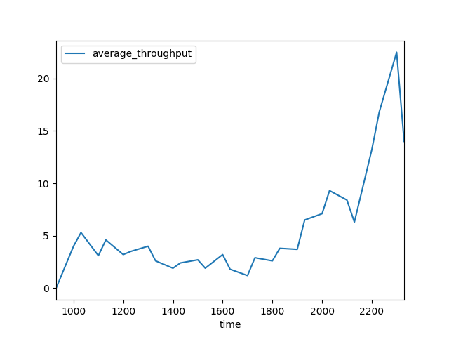

病院待ち時間予測プログラム
====

某病院の毎日の診察速度を観測し、それを元にあなたの今日の待ち時間を予測します。

## Description

私の近所にある某病院では、患者は診察前に診察番号を電話取得しなくてはなりません。現在診察を受けている患者の診察番号は、リアルタイムで病院ウェブサイトに表示されます。このプログラムを24時間常駐させると、病院のウェブサイトから診察状況を定時取得し、CSVファイルに記録します。このデータを元に時間帯別の平均的な診察処理速度を割り出し、「自分が持っている診察番号だと、受診は何時頃になるの？いつ家を出ればいいの？」という見当をつけたい、それが目的です。

## Usage

### Retrieval

- 診察状況の監視をする場合は`python retrieve.py`。（このプログラムは、「某病院」のウェブページに特化しているのでそれ以外には使うためにはWeb Scrapingの部分を大幅に書き直す必要があります。）設定すべきユーザー変数は
    - hospital_url: 病院の診察状況表示ページのURL
    - retrieval_cycle: 取得間隔（分）

### Analyze the data retrieved
- 溜まったCSVファイルを元に平均的な処理速度を計算するためには、`python analyze.py`。以下のユーザー変数を指定すると、だいたいの予想受診時刻を返します。
    - my_reception_num: 自分の診察番号
    - now_reception_num: 現在の診察番号
    - now_time: 現在時刻（HHMM）

時間帯別の平均診察人数は以下の通りでした。夜になると処理速度が激増するのは、「診察番号をとったけどやっぱり行かないことにした人」が増えるからだと思われます。

### Automatically reserve for a hospital

1. Download the Selenium driver for your Google Chrome version from [internet](https://chromedriver.chromium.org/downloads)
2. `vim ~/.bashrc`
3. `export SELENIUM_DRIVER_PATH="PATH_TO_THE_CHROMEDRIVER_FILE"`

## Requirements

`requirement.txt`を参照

## Todo 

- CUIだとインターフェースが使いにくすぎて非実用的なので、LINEボットやFlaskで展開すべき
- analyze.pyの内容があまりに非科学的だ。偏差などもグラフに描画すべきだし、受診時刻予想の部分も当たる確率を導けるはず。特に時刻を無理やり丸めるところが統計学的に雑すぎる。離散観測データを連続値に補間した上で、平均を計算すべき
- 曜日変動・季節変動はおそらくある。それがわかればおもしろい
    - 現時点ではデータの数が足りなさすぎるし、取得間隔30分より詰める必要があるかもしれない
- 時系列解析ができるならやる
    - データの性質上、難しそう。観測値が小さすぎる上に、各患者の受診時間は無秩序でバラバラで前後に相関がない